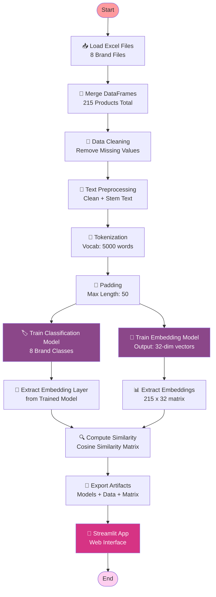
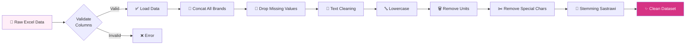
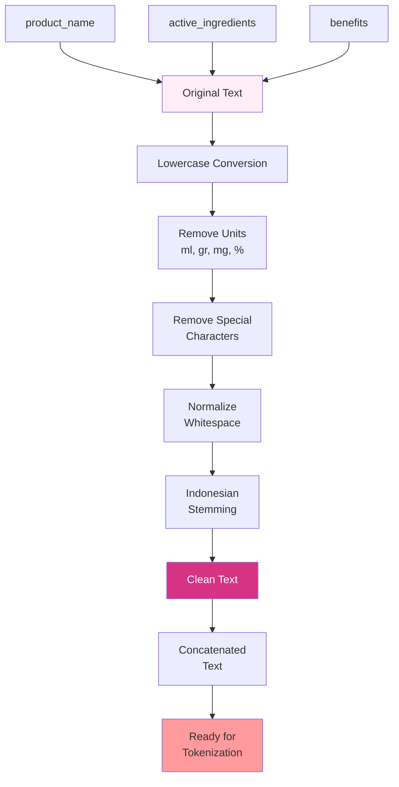
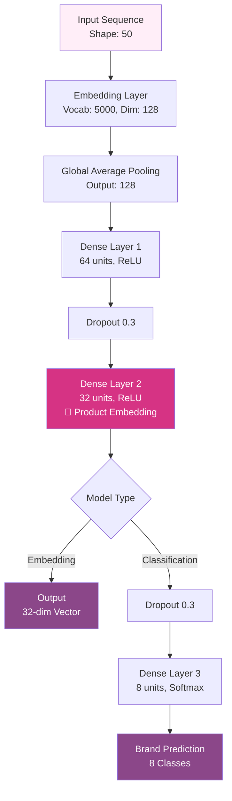
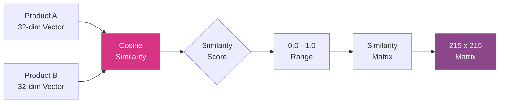
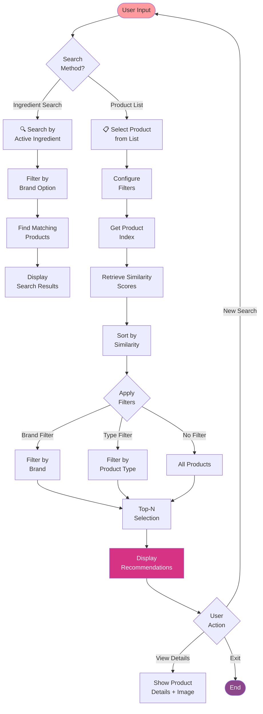
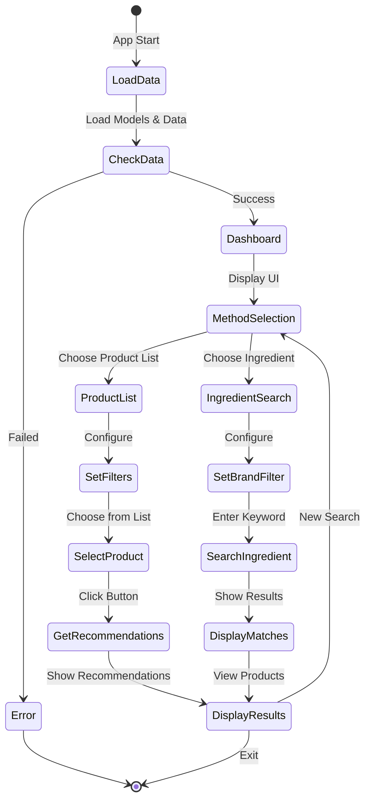
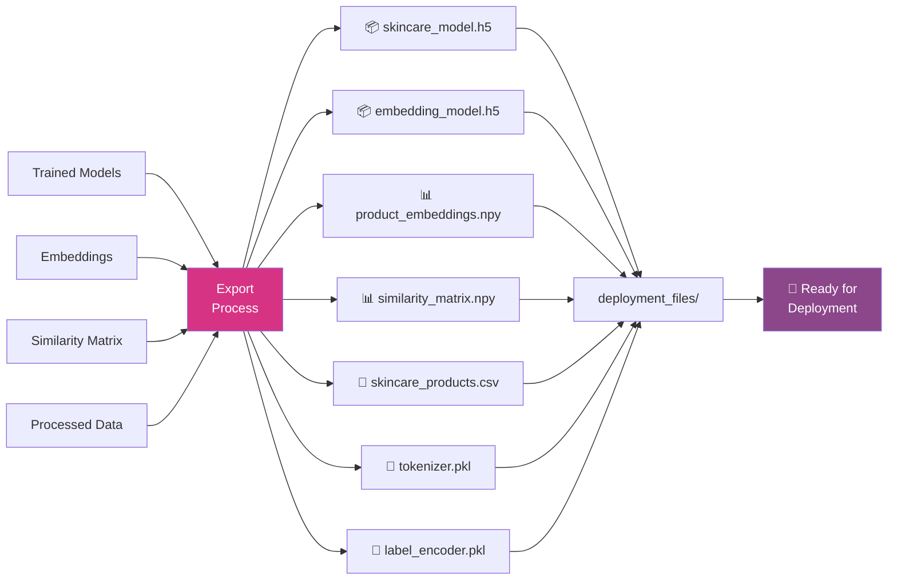
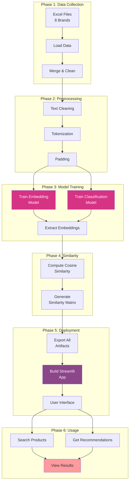

# 📊 Flowchart Sistem Rekomendasi Skincare

## 1. Overall System Architecture



## 2. Data Processing Pipeline



## 3. Text Preprocessing Detail



## 4. Neural Network Architecture



## 5. Training Process

```mermaid
flowchart TD
    A[Start Training] --> B[Split Data<br/>Train: 80% | Val: 20%]
    B --> C[Initialize Model<br/>Adam Optimizer]
    C --> D{Training Loop<br/>100 Epochs}
    
    D --> E[Forward Pass]
    E --> F[Calculate Loss]
    F --> G[Backpropagation]
    G --> H[Update Weights]
    H --> I{Validate}
    
    I -->|Each Epoch| J[Calculate<br/>Validation Metrics]
    J --> K{Epoch < 100?}
    K -->|Yes| D
    K -->|No| L[Select Best Model<br/>Based on Val Loss]
    
    L --> M[Training Complete]
    M --> N[Evaluate on<br/>Validation Set]
    N --> O[Generate<br/>Confusion Matrix]
    O --> P[Classification<br/>Report]
    P --> Q[End Training]
    
    style A fill:#ff9a9e
    style M fill:#d63384,color:#fff
    style Q fill:#8b4789,color:#fff
```

## 6. Similarity Computation



## 7. Recommendation System Flow



## 8. Streamlit App Flow



## 9. Data Export Process



## 10. Complete End-to-End Workflow



---

## 📝 Keterangan Simbol

| Simbol | Keterangan |
|--------|------------|
| 📥 | Input / Load Data |
| 🔗 | Merge / Combine |
| 🧹 | Cleaning / Preprocessing |
| 📝 | Text Processing |
| 🔢 | Tokenization / Encoding |
| 🧠 | Neural Network / Model |
| 📊 | Data Visualization / Matrix |
| 🔍 | Search / Similarity |
| 💾 | Save / Export |
| 🚀 | Deployment / Launch |
| ✅ | Success / Valid |
| ❌ | Error / Invalid |

---

## 🎯 Cara Menggunakan Flowchart

### Di README.md GitHub
Flowchart dengan format Mermaid akan otomatis ter-render di GitHub. Cukup copy-paste code mermaid ke dalam README.md Anda.

### Di Jupyter Notebook
Anda bisa menggunakan extension seperti `jupyterlab-mermaid` untuk menampilkan flowchart.

### Di Dokumentasi Online
Platform seperti:
- GitHub
- GitLab
- Notion
- Obsidian
- VS Code (dengan extension Markdown Preview Mermaid Support)

Semua mendukung rendering Mermaid diagram secara native.

### Export sebagai Gambar
Gunakan tools online seperti:
- https://mermaid.live
- https://mermaid.ink

Untuk mengkonversi flowchart menjadi PNG/SVG.

---

## 💡 Tips Presentasi

1. **Untuk Presentasi Teknis**: Gunakan flowchart 1, 4, 5, dan 10 (Overview + Detail)
2. **Untuk User Demo**: Gunakan flowchart 7 dan 8 (Recommendation Flow + App Flow)
3. **Untuk Dokumentasi**: Gunakan semua flowchart untuk pemahaman lengkap

---

<div align="center">

**Flowchart dibuat dengan 💖 menggunakan Mermaid.js**

</div>
